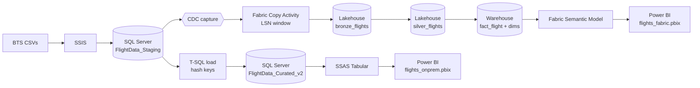

# Flight Data — On-Prem SQL Server → Microsoft Fabric Migration

> **Reference implementation, public data.** This repository is the publishable
> companion to the production Fabric migration I led at Koinonia Enterprises.
> The techniques (CDC, hash surrogate keys, medallion lakehouse, SSAS/Fabric
> parallel) are the ones used in production; the data here is the **public BTS
> on-time flight dataset** so the patterns can be shared without exposing
> company data. Treat this as a learnable, runnable proxy — not a screenshot
> of the real platform.

## The problem this solves

A working on-prem analytics stack — SSIS loading flight CSVs into SQL
Server, SSAS Tabular feeding Power BI — needs to move to Microsoft Fabric
without losing CDC, surrogate-key continuity, or the existing reports.

The migration hits two walls the on-prem version had hidden:

1. **Surrogate keys do not survive the move.** `INT IDENTITY` works inside
   one database. Two databases (on-prem + Fabric) cannot agree on the next
   value, and `MAX(id) + ROW_NUMBER()` is a race condition under parallel
   notebooks.
2. **Full reloads stop scaling.** Re-reading 3.5M rows over the gateway on
   every refresh is wasteful and fragile.

This repository documents how both walls are solved and how a one-month
SSAS / Fabric parallel run validates the migration is lossless before the
on-prem stack is decommissioned — the same shape of work I shipped at
Koinonia, rebuilt here on data anyone can re-download.

## Architecture



## What's in this repo

| Folder                | Contents                                              |
| --------------------- | ----------------------------------------------------- |
| `sql_onprem/`         | Schema, load, CDC, run-log, DQ scripts                |
| `fabric_migration/`   | Fabric notebooks (bronze/silver/gold) + flow docs     |
| `ssas/`               | Tabular Model.bim + deploy script                     |
| `pbi/`                | Two Power BI files: SSAS-backed + Fabric-backed       |
| `tests/`              | SQL test suite + PowerShell runner                    |
| `docs/`               | Discovered state, ADRs, limitations, security, runbook|
| `data/raw_csv/`       | BTS source files                                      |

## Key design decisions (ADRs)

1. [Hash surrogate keys over INT IDENTITY](docs/adr/0001-hash-keys-over-identity.md)
2. [Keep on-prem alive for one month after Fabric goes live](docs/adr/0002-keep-onprem-during-migration.md)
3. [SSAS Tabular and Fabric semantic model side by side](docs/adr/0003-ssas-and-fabric-side-by-side.md)
4. [CDC incremental loads over full reload](docs/adr/0004-cdc-over-full-reload.md)
5. [Star schema over OBT](docs/adr/0005-star-schema-over-obt.md)
6. [Import mode in SSAS, DirectQuery documented](docs/adr/0006-import-vs-directquery-in-ssas.md)
7. [Clustered columnstore on FactFlight](docs/adr/0007-clustered-columnstore-on-fact.md)
8. [Quarantine bad rows over fail fast](docs/adr/0008-quarantine-over-fail-fast.md)

## How to run it

```powershell
# 1. Build curated_v2, load dims and fact
sqlcmd -S localhost -E -C -i sql_onprem/01_create_databases.sql
sqlcmd -S localhost -E -C -i sql_onprem/02_create_staging.sql
sqlcmd -S localhost -E -C -i sql_onprem/03_create_star_schema.sql
sqlcmd -S localhost -E -C -i sql_onprem/04_load_dimensions.sql
sqlcmd -S localhost -E -C -i sql_onprem/05_load_fact.sql

# 2. Wire observability + DQ
sqlcmd -S localhost -E -C -i sql_onprem/20_etl_runlog.sql
sqlcmd -S localhost -E -C -i sql_onprem/21_dq_framework.sql
sqlcmd -S localhost -E -C -i sql_onprem/22_reconciliation_view.sql

# 3. Enable CDC
sqlcmd -S localhost -E -C -i sql_onprem/10_enable_cdc.sql
sqlcmd -S localhost -E -C -i sql_onprem/11_cdc_window_function.sql
sqlcmd -S localhost -E -C -i sql_onprem/12_watermark_table.sql

# 4. Validate
.\tests\run_tests.ps1

# 5. Deploy SSAS Tabular
.\ssas\deploy.ps1
```

## Quality gates

- Row counts: staging ↔ curated must agree per month
  (`dq.vw_pipeline_reconciliation`)
- No orphan FKs in `FactFlight`
- Hash keys unique in current dim rows
- DimDate covers every distinct fact date
- Cancelled flights have no arrival time

All of the above are enforced by `tests/run_tests.ps1`.

## Author

**Mario Nagi** — Data & IT Lead, Koinonia Enterprises.
[LinkedIn](https://www.linkedin.com/in/marionagi) ·
[GitHub](https://github.com/MarioNagi) ·
[Email](mailto:mario_nagi@yahoo.com)

Companion project: [MigrationLab](https://github.com/MarioNagi/MigrationLab) —
SQL-first enterprise migration reference with ADRs, tests, and CI.
